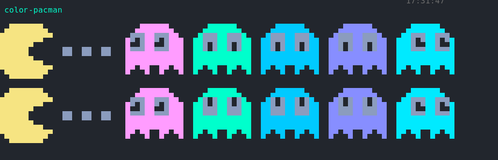

# /bin

| Script | Functionality |
|--------x---------------|
| $ | Yells at me for being lazy while copy-pasting commands and not remove the $ sign |
| awmtt | **not my work** tests awesomewm in Xephyr and prints log to stdout |
| color-* | Scripts that print images using the terminal colors to test or demonstrate them. |
| git-cleanup | Creates a new branch, deletes the others then copies the branch to the main. Erases the history of a repo |
| gita | git pull && git add . && git commit -m "message" and git push --force in one command, prompts you for a message |
| git-setup | Quickly deploys a git repo in the present directory |
| grub2-theme-preview | wrapped for Xephyr to preview my grub theme |
| prune-dirs | remove empty directories underneath and including PWD |
| qtest | WIP testing file for qtile that handles errors better than breaking my config with a refresh while editing it |
| screenshots | an import for my other wm environments that comes from my awesomewm configuration _thanks manilarome for doing the legwork, I just ported to my uses_. Its a shell script with some lua that wraps the maim command and produces notification afterwards letting the user know things worked out |
| shell-struct | Writes the header of a shell script out, takes a title as input |
| sound-* | Sounds generated with the beep command using the motherboard's beep functionality |
| xfce4-restart | Restarts the components of XFCE4 all at once |
| xs | A fuzzy package finder for Void Linux (current distro) that eases the use of its package manager's search considerbaly |
| zsh-history | for when my zsh history decides to become corrupted |
