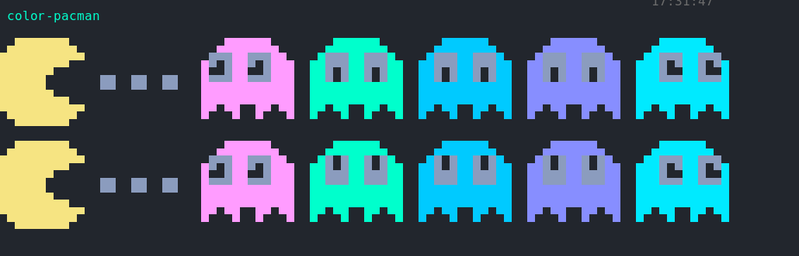

# /bin

These are my personal scripts, that are part of my [dotfiles](https://github.com/Thomashighbaugh/dotfiles] but are split out of the main repo for purposes of keeping some order in that repository, leveraging the utility that is provided by the very over written installation script in the above mentioned repository, enabling me to even skip the truly unhelpful submodules repository in one's dotfiles of their own work.

### Unhelpful?! But I love submodules!

Yeah, so do I, when they are actually useful in the right situations like any other software tool, but in terms of keeping your dotfiles separated in separate repositories is not one of those. The reason for this is having such submodules means that they are pulled into the dotfiles repository still and thus still require symlinking to their intended location, this the abstraction is far less helpful and retain the same ultimate point of failure, namely those symlinks that are fussy at times and in Linux there is no shortage of verification of Murphy's Law.

Thus to mitigate this point of failure, I wrote out an installation script in BASH that clones the various satellite repositories that are part of my dotfiles directly into the location that they are expected by the system. In my usage, this has proven to be the most reliable means of insuring they are integrated into my environment, especially when combined with the multi-repository management software `myrepos` allowing me a rapid means of insuring everything is updated in cases of kernel panics, system crashes or the impulsive re-installation.

## Enough About How These Relate to Your Other Dotfiles, What's in Here?

### Terminal Color Display Scripts

Mostly my terminal color display scripts I have collected for years now. These scripts are used to display one's configured Xresources colors at a glace.

An example

### Sound Files

Do you desire to hear the theme from Beverly Hills Cop whenever you login to your system? Well I do and that process requires a line in my zsh configuration and the file in the `sounds/` subdirectory of this repository. You may find this annoying, my girlfriend certainly does, but there are plenty of other things you could do with a beep comand and access to someone else's machine using the beep command!

### A Minimal Neofetch Replacement

Its called `fet.sh` and like the above, its also not my own work product but for staging screenshots, its less intrusive and I like how sleek it is.

### Some Personal Scripts and Functions

| Script | Functionality |
|--------x---------------|
| $ | Yells at me for being lazy while copy-pasting commands and not remove the $ sign |
| display-manager | WIP eventually my replacement for the buggy nightmare that lightdm is 1/2 the time |
| git-hist-erase | for nuking the history of a repo |
| gita | git add . && git commit -m "message" and git push --force in one command, allows custom git commit message hence its not an alias |
| grub2-theme-preview | wrapped for Xephyr to preview my grub theme |
| launcher | wrapper for my rofi command for use in various non-AwesomeWM environments |
| mirror-mirror | gets arch mirrors for the US without fussing too much |
| pacman-list | prints a list of packages |
| prune-dirs | remove empty directories underneath and including PWD |
| qtest | WIP testing file for qtile that handles errors better than breaking my config with a refresh while editing it |
| scm | based on an olde tyme version control system's name, this basically clones repos to a specific place on my local mirror of my dropbox folder and where I stash things for later viewing mostly |
| screenshots | an import for my other wm environments that comes from my awesomewm configuration _thanks manilarome for doing the legwork, I just ported to my uses_. Its a shell script with some lua that wraps the maim command and produces notification afterwards letting the user know things worked out |
| shell-struct | A script that is deprecated thanks to vim's template feature but once was what I used for shell scripts to create a template for consistency purposes |
| svg-color | Don't just use this! This is meant to be a series of color replacements with sed for editing svg icons when I am bring in icons from other icon packs to one of my own but need to change their colors to reflect my colorscheme |
| tuned-linux | Don't use this legacy script, it is too much a work in progress that I am starting to update for modern sysctl.conf like purposes. |
| urxvt-config | sometimes, I like torturing myself with non-functional 'minimalist' terminal emulators that can't support icons without dubious patching so I use urxvt and this script configures it |
| vm2md | A semi-functional script that converted my vimwiki from vimwiki format to markdown when I decided I preferred the syntax of the latter. |
| zsh-history | for when my zsh history decides to become corrupted |
